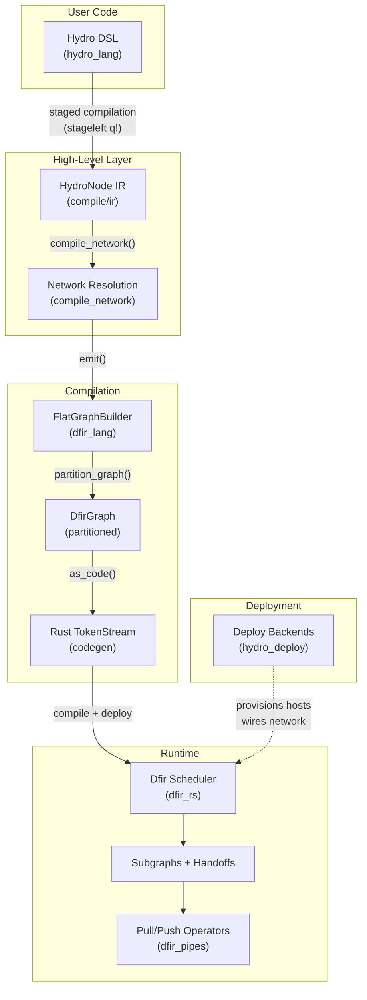
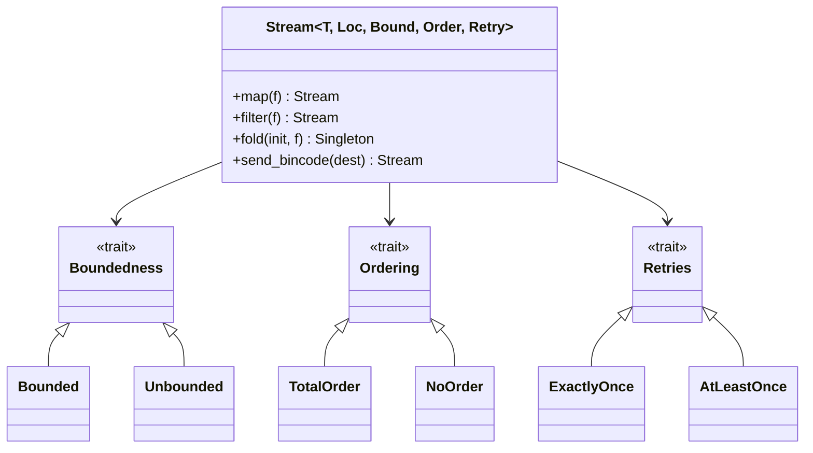
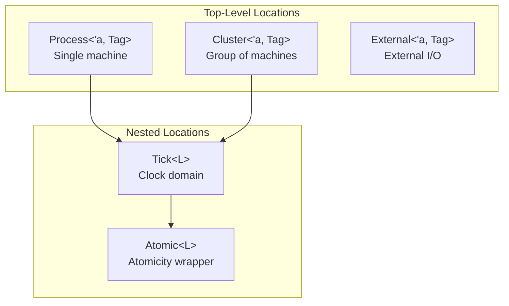
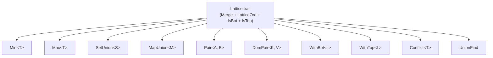
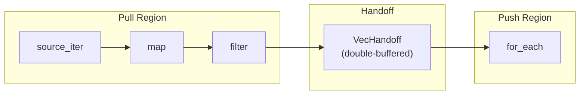
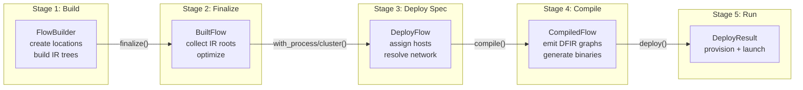
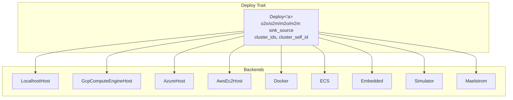
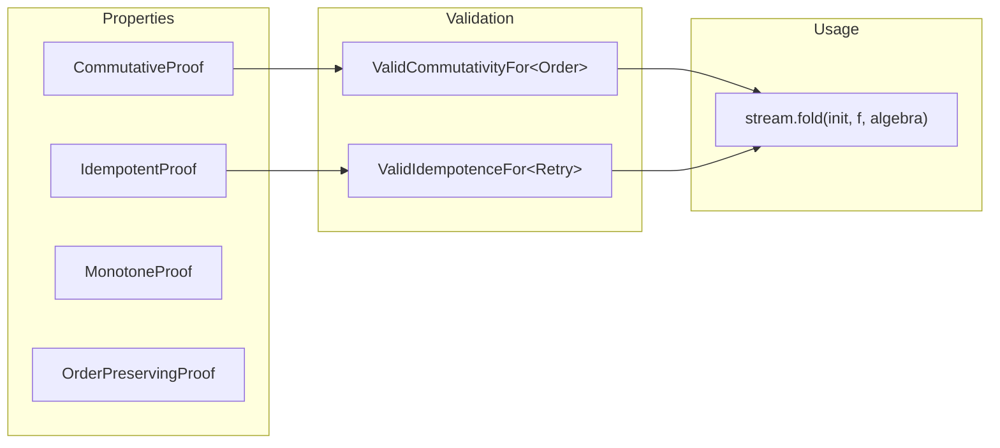

# Architecture

## Layered Architecture

Hydro follows a layered compiler architecture where high-level distributed programs are progressively lowered through intermediate representations to executable dataflow graphs.



## Core Design Principles

### 1. Staged Programming (stageleft)

User code is written using the `q!(...)` quoting macro from `stageleft`. Expressions inside `q!()` are captured as AST at compile time and emitted into generated DFIR code for each deployment location. This enables:
- Type-safe code generation without string templates
- IDE support (autocomplete, type checking) for distributed programs
- Zero-cost abstractions — generated code is monomorphized Rust

### 2. Type-Level Distributed Safety

The type system encodes distributed properties as phantom type parameters:



When data crosses network boundaries, the type parameters are weakened based on transport properties (e.g., TCP lossy → `NoOrder`, `AtLeastOnce`). Operations like `fold` on unordered streams require algebraic property proofs (commutativity, idempotence).

### 3. Location-Typed Computation

Every computation is associated with a `Location` — a typed representation of where code runs:



Phantom tag types (e.g., `Process<'a, Leader>` vs `Process<'a, Follower>`) distinguish locations at the type level, preventing accidental cross-location data access.

### 4. Lattice-Based CRDTs

The `lattices` crate provides algebraic types where merge is associative, commutative, and idempotent — the foundation for conflict-free replicated data types:



### 5. Push-Pull Dataflow Execution

The DFIR runtime uses a hybrid push-pull execution model within subgraphs:



- **Pull operators** are composed as Rust iterators (lazy evaluation)
- **Push operators** are composed as closure chains (eager evaluation)
- **Handoffs** (double-buffered `Vec<T>`) connect subgraphs across push-pull boundaries

### 6. Stratified Scheduling

The runtime executes subgraphs in strata to handle non-monotonic operations correctly:

```mermaid
sequenceDiagram
    participant S0 as Stratum 0<br/>(sources)
    participant S1 as Stratum 1<br/>(monotone ops)
    participant S2 as Stratum 2<br/>(non-monotone ops)
    participant Loop as Loop Block

    Note over S0,S2: Tick N
    S0->>S1: data via handoffs
    S1->>S1: run to fixpoint
    S1->>S2: barrier (Stratum delay)
    S2->>S2: run to fixpoint

    Note over Loop: Loop iteration
    Loop->>Loop: repeat until no new data

    Note over S0,S2: Tick N+1
    S0->>S1: new external events
```

## Compilation Pipeline Detail



Each stage is a distinct type (`FlowBuilder` → `BuiltFlow` → `DeployFlow` → `CompiledFlow` → `DeployResult`), enforcing correct ordering via Rust's type system.

## Deployment Architecture



The `Deploy<'a>` trait abstracts over deployment targets. Each backend implements host provisioning, binary compilation/copying, network wiring, and service lifecycle management.

## Non-Determinism Tracking

Hydro requires explicit documentation of every non-determinism source via the `NonDet` type and `nondet!` macro:

```rust
// Must explain WHY this is non-deterministic
let timer = process.source_interval(nondet!(
    /// Timer for heartbeat — ordering of heartbeats relative to
    /// other messages is non-deterministic
    Duration::from_secs(1)
));
```

APIs like `source_interval()`, `batch()`, `sample_every()` require a `NonDet` parameter. The `nondet!` macro enforces a doc-comment explanation.

## Algebraic Property System

For operations on unordered/at-least-once streams, the type system requires proofs:



- `NotProved` commutativity is valid for `TotalOrder` streams (order guaranteed)
- `NotProved` commutativity requires `Proved` for `NoOrder` streams
- `ManualProof` + `manual_proof!` macro allows human-written justifications
