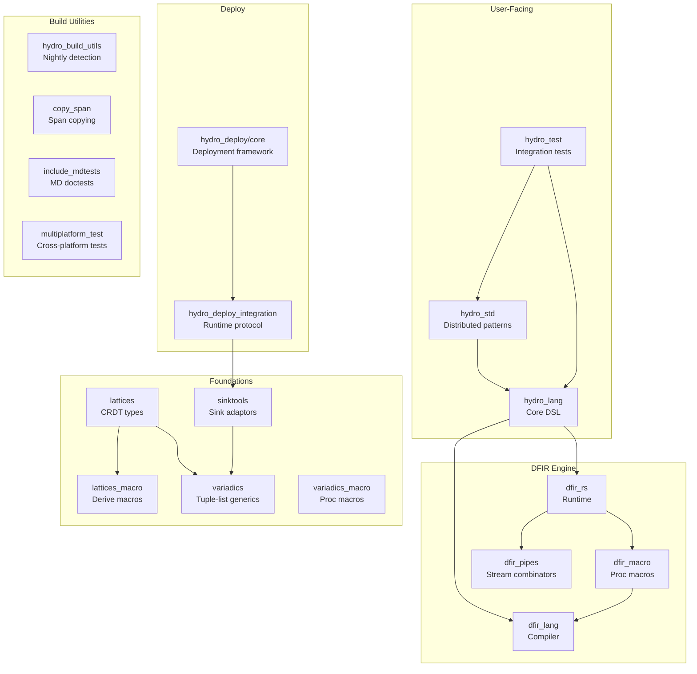

# Components

## Component Map

## Core Components

### hydro_lang — Core Distributed Programming Framework

**Path:** `hydro_lang/`  
**Role:** The primary user-facing crate. Provides the Hydro DSL for writing distributed programs with compile-time safety guarantees.

**Key responsibilities:**
- Defines live collection types (`Stream`, `Singleton`, `Optional`, `KeyedStream`, `KeyedSingleton`) with type-level safety parameters
- Defines location types (`Process`, `Cluster`, `External`, `Tick`, `Atomic`)
- Implements the staged compilation pipeline (`FlowBuilder` → `BuiltFlow` → `DeployFlow` → `CompiledFlow`)
- Manages the `HydroNode` intermediate representation
- Provides networking configuration (`TCP`, serialization, failure policies)
- Implements algebraic property proofs for safe aggregation
- Provides the `NonDet` guard for non-determinism tracking

**Entry points:**
- `FlowBuilder::new()` — starts a new distributed program
- `Stream`, `Singleton`, etc. — collection types with operator methods
- `q!()` macro (from stageleft) — quotes Rust expressions for staged compilation

### hydro_std — Standard Distributed Patterns

**Path:** `hydro_std/`  
**Role:** Reusable higher-level distributed systems building blocks.

**Key modules:**
- `quorum` — Quorum collection and voting logic for consensus protocols
- `request_response` — Request-response communication pattern
- `compartmentalize` — Data partitioning/sharding strategies
- `membership` — Cluster membership management
- `bench_client` — Benchmarking client utilities

### hydro_test — Integration Test Suite

**Path:** `hydro_test/`  
**Role:** Comprehensive test suite exercising distributed patterns.

**Test categories:**
- `cluster/` — Cluster algorithm tests (Paxos, two-phase commit, KVS)
- `distributed/` — Distributed protocol tests
- `embedded/` — Embedded execution tests
- `external_client/` — External client interaction
- `local/` — Local execution tests (graph reachability, count-to-n, deadlock detection)
- `maelstrom/` — Jepsen-style distributed testing
- `tutorials/` — Tutorial examples as tests
- `kafka/` — Kafka integration (feature-gated)

---

## DFIR Engine Components

### dfir_lang — DFIR Compiler

**Path:** `dfir_lang/`  
**Role:** Parses DFIR surface syntax, builds dataflow graphs, partitions into subgraphs, and generates Rust code.

**Pipeline:**
1. **Parse** (`parse.rs`) — Surface syntax → `DfirCode` AST
2. **Flat graph** (`FlatGraphBuilder`) — AST → flat `DfirGraph` with operators and edges
3. **Partition** (`flat_to_partitioned.rs`) — Flat graph → partitioned graph with subgraphs, handoffs, and strata
4. **Codegen** (`DfirGraph::as_code()`) — Partitioned graph → Rust `TokenStream`

**Key data structures:**
- `DfirGraph` — The central graph representation (SlotMap-based nodes, edges, subgraphs, loops)
- `GraphNode` — `Operator`, `Handoff`, or `ModuleBoundary`
- `OperatorConstraints` — Static definition of each operator's requirements
- `DiMulGraph<V, E>` — Directed multigraph with SlotMap-based adjacency

**Operator system:** ~80+ operators defined in `src/graph/ops/`, each as a static `OperatorConstraints` with input/output ranges, delay types, and code generation functions.

### dfir_macro — DFIR Proc Macros

**Path:** `dfir_macro/`  
**Role:** Bridges `dfir_lang` to Rust's macro system.

**Exports:**
- `dfir_syntax!` — Compiles DFIR surface syntax into a `Dfir` instance
- `dfir_syntax_inline!` — Inline variant (no scheduler, local buffers)
- `dfir_parser!` — Parses DFIR syntax without compilation
- `#[derive(DemuxEnum)]` — Generates demux routing for enum types

### dfir_rs — DFIR Runtime

**Path:** `dfir_rs/`  
**Role:** The execution engine. Schedules subgraphs, manages handoffs, and provides the runtime context.

**Key types:**
- `Dfir<'a>` — The runtime graph instance with scheduler
- `Context` — Runtime API for operators (tick/stratum info, state management, scheduling)
- `VecHandoff<T>` — Double-buffered inter-subgraph communication
- `TeeingHandoff<T>` — Fan-out handoff (one sender, multiple receivers)
- `Port<S, H>` / `PortCtx<S, H>` — Typed port references and contexts
- `StateHandle<T>` — Handle for operator-local persistent state

**Execution model:**
- Stratum-based scheduling within ticks
- FIFO queues per stratum for ready subgraphs
- Loop iteration tracking with `allow_another_iteration` flag
- Async integration via tokio wakers

### dfir_pipes — Stream Combinators

**Path:** `dfir_pipes/`  
**Role:** `#![no_std]` pull/push stream combinators with type-level capability tracking.

**Key traits:**
- `Pull` — Async pull-based streams with `poll_next()`, parameterized by `CanPend` and `CanEnd`
- `Push` — Push-based sinks with combinators
- `Context` — Abstracts sync vs async execution
- `Toggle` — Type-level booleans (`Yes`/`No`) for compile-time capability encoding

---

## Deploy Components

### hydro_deploy/core — Deployment Framework

**Path:** `hydro_deploy/core/`  
**Role:** Orchestrates deployment of Hydro programs across cloud providers and localhost.

**Key abstractions:**
- `Deployment` — Top-level orchestrator for the deploy lifecycle
- `Host` trait — Abstraction over deployment targets (port allocation, provisioning, server strategies)
- `Service` trait — Lifecycle management (collect_resources → deploy → ready → start → stop)
- `LaunchedBinary` trait — Running binary management (stdin/stdout/stderr, exit codes)

**Host implementations:** `LocalhostHost`, `GcpComputeEngineHost`, `AzureHost`, `AwsEc2Host`

**Network strategies:** `ServerStrategy` (Direct, Many, Demux, Merge, Tagged, Null) for configuring how services bind and connect.

### hydro_deploy_integration — Runtime Deploy Protocol

**Path:** `hydro_deploy/hydro_deploy_integration/`  
**Role:** Runtime-side protocol for deployed binaries to communicate with the deploy orchestrator. Provides `ServerBindConfig` and network setup utilities.

---

## Foundation Components

### lattices — Lattice Types

**Path:** `lattices/`  
**Role:** Composable lattice data types for CRDT-style distributed state convergence.

**Core trait:** `Lattice` = `Merge + LatticeOrd + NaiveLatticeOrd + IsBot + IsTop`

**Concrete types:** `Min<T>`, `Max<T>`, `SetUnion`, `MapUnion`, `VecUnion`, `Pair`, `DomPair`, `WithBot`, `WithTop`, `Conflict`, `Point`, `UnionFind`

**Advanced features:** Morphisms (`LatticeMorphism`, `LatticeBimorphism`), generalized hash tries (`ght` module), semiring support, tombstone collections.

### variadics — Variadic Generics

**Path:** `variadics/`  
**Role:** Variadic generics on stable Rust using recursive tuple lists `(A, (B, (C, ())))`.

**Key macros:** `var_expr!` (values), `var_type!` (types), `var_args!` (patterns)

**Key traits:** `Variadic`, `VariadicExt` (LEN, Extend, Reverse, Split), `VecVariadic` (column-store operations)

### sinktools — Sink Adaptors

**Path:** `sinktools/`  
**Role:** Extends `futures::Sink` with composable adaptors and a forward-building `SinkBuild` API.

**Key types:** `SinkBuild` trait, `SinkBuilder<Item>`, demux sinks (`DemuxMap`, `DemuxVar`), lazy sinks.

---

## Build Utility Components

| Crate | Path | Purpose |
|---|---|---|
| `hydro_build_utils` | `hydro_build_utils/` | Nightly detection (`emit_nightly_configuration!`), snapshot test helpers |
| `copy_span` | `copy_span/` | Proc-macro for copying token spans (better error messages) |
| `include_mdtests` | `include_mdtests/` | Proc-macro converting markdown files to doctests |
| `multiplatform_test` | `multiplatform_test/` | `#[multiplatform_test]` attribute for cross-platform testing |
| `example_test` | `example_test/` | Example test utilities |

---

## Non-Crate Components

| Directory | Purpose |
|---|---|
| `template/` | cargo-generate templates for new Hydro and DFIR projects |
| `design_docs/` | Historical design documents (architecture, time/strata, lattice properties) |
| `docs/` | Docusaurus website source (hydro.run) |
| `benches/` | Microbenchmarks |
| `website_playground/` | WASM playground for browser-based DFIR compilation |
| `scripts/` | Build, release, and validation scripts |
| `cdk/` | CDK infrastructure |
| `infrastructure_cdk/` | Infrastructure CDK |
