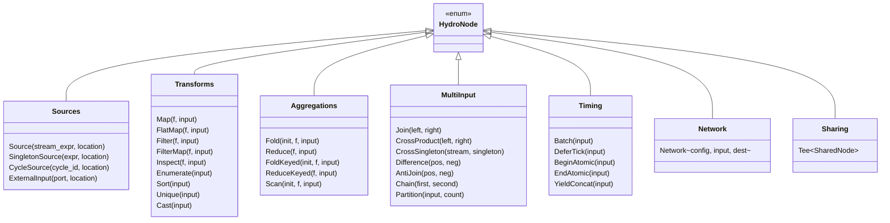
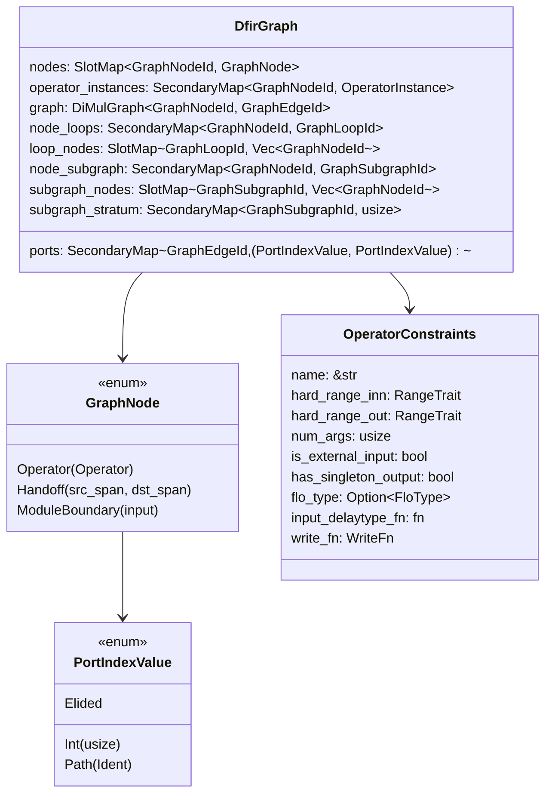
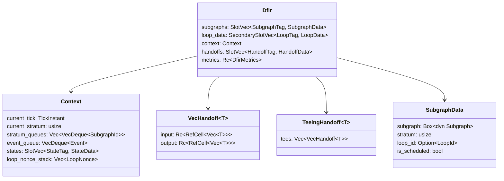
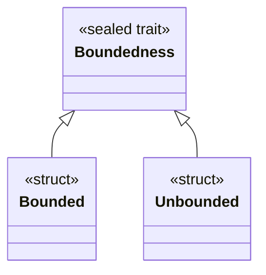
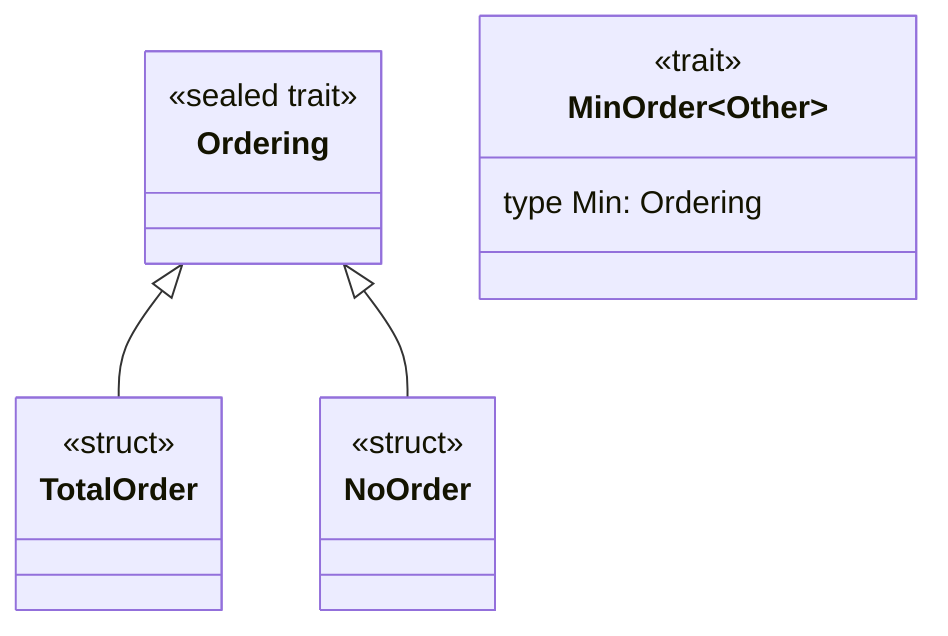
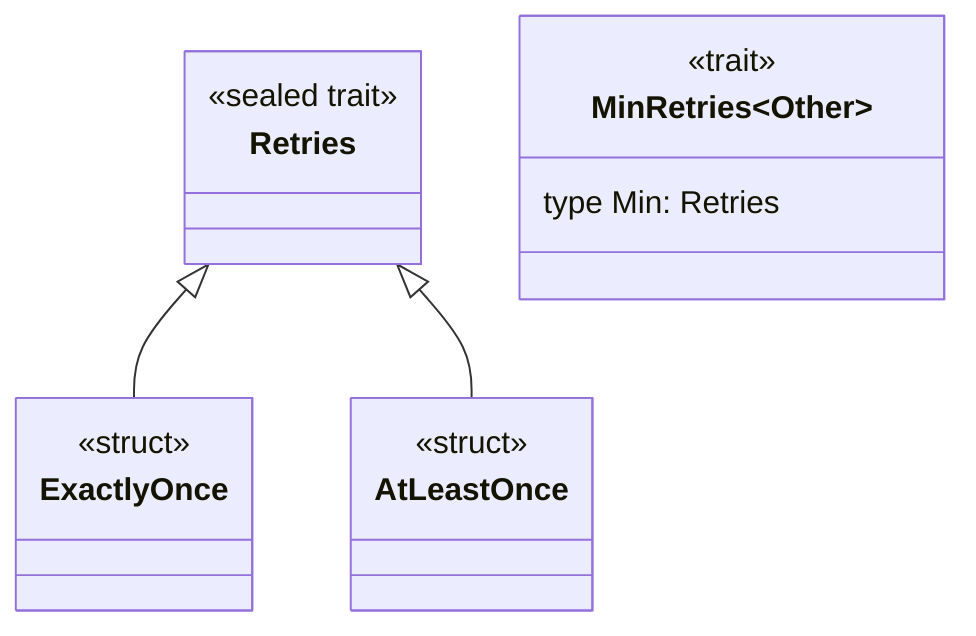
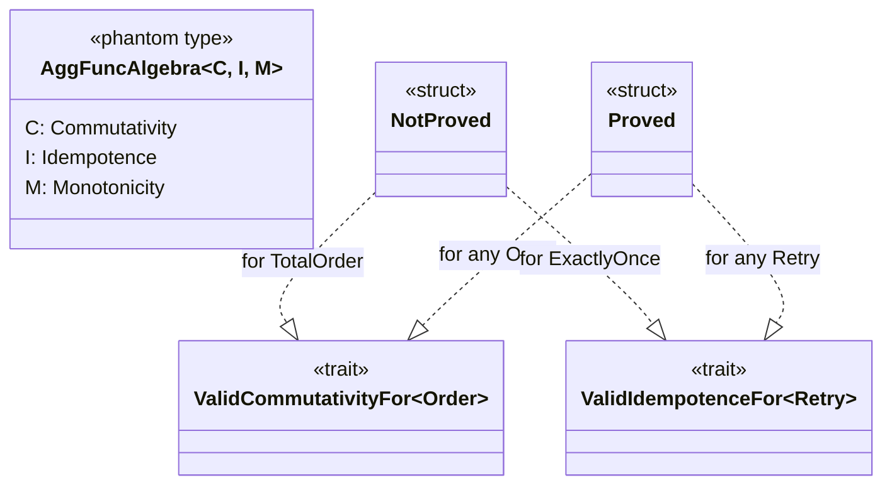
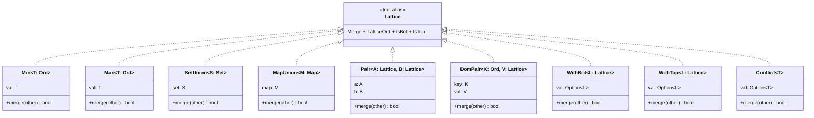

# Data Models

## Compile-Time IR

### HydroNode — High-Level IR

The intermediate representation built by `hydro_lang` collection operations. Each live collection wraps a `RefCell<HydroNode>`.



Each node carries `HydroIrMetadata`:
- `location_id: LocationId` — which location this node runs on
- `collection_kind: CollectionKind` — Stream, Singleton, Optional, etc.
- `cardinality: Option<Cardinality>` — estimated output size
- `tag: Option<String>` — debug label
- `op_metadata: HydroIrOpMetadata` — backtrace, CPU usage, unique ID

### HydroRoot — Terminal IR Nodes

Terminal nodes that consume data (no downstream):

| Variant | Description |
|---|---|
| `ForEach(f, input)` | Side-effecting consumption |
| `SendExternal(port, input)` | Send to external process |
| `DestSink(sink_expr, input)` | Send to a futures::Sink |
| `CycleSink(cycle_id, input)` | Complete a forward reference cycle |
| `EmbeddedOutput(input)` | Output in embedded mode |
| `Null(input)` | Dropped/unused stream |

---

## DFIR Graph Model

### DfirGraph — Partitioned Dataflow Graph

The central compile-time graph representation in `dfir_lang`:



### DiMulGraph — Directed Multigraph

```rust
struct DiMulGraph<V: Key, E: Key> {
    edges: SlotMap<E, (V, V)>,           // edge → (src, dst)
    succs: SecondaryMap<V, Vec<E>>,      // vertex → outgoing edges
    preds: SecondaryMap<V, Vec<E>>,      // vertex → incoming edges
}
```

All graph entities use `SlotMap` keys for O(1) lookup with generation-checked safety.

---

## Runtime Data Structures

### Dfir — Runtime Graph Instance



### StateHandle — Operator State

```rust
struct StateHandle<T> {
    key: StateKey,
    _phantom: PhantomData<T>,
}
```

Operators access persistent state via `context.state_ref(handle)` / `context.state_mut(handle)`. State persists across ticks based on the operator's persistence lifetime (`'none`, `'loop`, `'tick`, `'static`, `'mutable`).

---

## Type-Level Models

### Boundedness



### Ordering



`MinOrder` computes the weaker ordering: `TotalOrder ∧ TotalOrder = TotalOrder`, otherwise `NoOrder`.

### Retries



### Algebraic Properties



---

## Location Models

### LocationId

```rust
enum LocationId {
    Process(usize),
    Cluster(usize),
    External(usize),
}
```

### MemberId

```rust
struct MemberId<Tag> {
    id: u32,
    _phantom: PhantomData<Tag>,
}
```

Type-safe cluster member addressing. `Tag` matches the `Cluster<'a, Tag>` to prevent cross-cluster member confusion.

---

## Lattice Types

### Core Lattice Hierarchy



### Merge Semantics

| Type | Merge Operation | Bot | Top |
|---|---|---|---|
| `Min<T>` | `min(self, other)` | `T::MAX` | `T::MIN` |
| `Max<T>` | `max(self, other)` | `T::MIN` | `T::MAX` |
| `SetUnion<S>` | Set union | `∅` | — |
| `MapUnion<M>` | Union with per-key merge | `∅` | — |
| `Pair<A, B>` | Component-wise merge | `(⊥_A, ⊥_B)` | `(⊤_A, ⊤_B)` |
| `DomPair<K, V>` | Higher key dominates; equal keys merge values | — | — |
| `WithBot<L>` | Adds explicit bottom (`None`) | `None` | — |
| `WithTop<L>` | Adds explicit top (`None` = ⊤) | — | `None` |
| `Conflict<T>` | Equal values merge; different values → ⊤ (conflict) | `None` | conflict state |

---

## Deployment Models

### ServerStrategy

```rust
enum ServerStrategy {
    Direct(PortConfig),
    Many(Vec<PortConfig>),
    Demux(HashMap<u32, ServerStrategy>),
    Merge(Vec<ServerStrategy>),
    Tagged(Box<ServerStrategy>, u32),
    Null,
}
```

### HostTargetType

```rust
enum HostTargetType {
    Local,
    Linux(LinuxCompileType),
}

enum LinuxCompileType {
    Musl,
    Gnu,
}
```

### ResourcePool / ResourceBatch / ResourceResult

The deployment resource lifecycle:
1. `ResourceBatch` — collects resource requests from hosts/services
2. `ResourcePool` — provisions resources (Terraform, SSH, etc.)
3. `ResourceResult` — provides provisioned resource handles back to hosts
