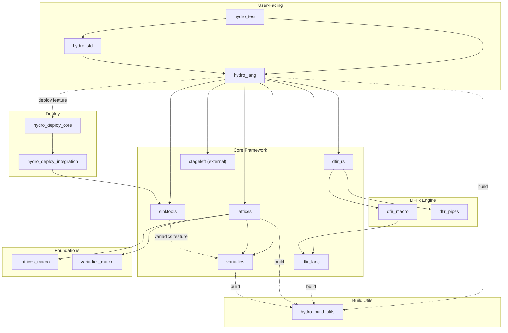

# Dependencies

## Workspace Internal Dependency Graph

Dashed lines indicate build-time or feature-gated dependencies.

## Key External Dependencies

### Staged Programming

| Crate | Version | Used By | Purpose |
|---|---|---|---|
| `stageleft` | 0.13.4 | hydro_lang, hydro_std | Staged programming framework — `q!()` macro for compile-time code generation |
| `stageleft_tool` | 0.13.4 | hydro_std, hydro_test | Build-time tool for stageleft code generation |

### Async Runtime

| Crate | Version | Used By | Purpose |
|---|---|---|---|
| `tokio` | 1.x | dfir_rs, hydro_deploy | Async runtime (rt, macros, net, io, time, process, signal, sync, fs) |
| `tokio-stream` | 0.1.x | dfir_rs, hydro_deploy | Stream utilities for tokio |
| `tokio-util` | 0.7.x | hydro_deploy_integration | Codec and utility extensions |
| `futures` | 0.3.x | dfir_rs, sinktools | Futures traits and combinators |
| `futures-core` | 0.3.x | dfir_pipes | Core futures traits (no_std compatible) |

### Serialization

| Crate | Version | Used By | Purpose |
|---|---|---|---|
| `serde` | 1.x | Most crates | Serialization framework |
| `serde_json` | 1.x | dfir_rs, hydro_deploy | JSON serialization |
| `bincode` | 2.x | hydro_lang | Binary serialization for network messages |
| `bytes` | 1.x | hydro_lang, hydro_deploy | Byte buffer utilities |

### Proc Macro Infrastructure

| Crate | Version | Used By | Purpose |
|---|---|---|---|
| `syn` | 2.x | dfir_lang, dfir_macro, lattices_macro | Rust syntax parsing |
| `quote` | 1.x | dfir_lang, dfir_macro | Rust code generation |
| `proc-macro2` | 1.x | dfir_lang, dfir_macro, copy_span | Token stream manipulation |
| `proc-macro-crate` | 3.x | dfir_macro | Crate name resolution in proc macros |

### Graph Data Structures

| Crate | Version | Used By | Purpose |
|---|---|---|---|
| `slotmap` | 1.x | dfir_lang, dfir_rs | SlotMap-based graph node/edge storage |
| `smallvec` | 1.x | dfir_lang | Small-size-optimized vectors |

### Cloud Providers (hydro_deploy)

| Crate | Version | Used By | Purpose |
|---|---|---|---|
| `async-ssh2-lite` | — | hydro_deploy | SSH connections for remote deployment |
| `nanoid` | — | hydro_deploy | Unique ID generation for resources |
| `nix` | — | hydro_deploy | Unix system calls |
| `indicatif` | — | hydro_deploy | Progress bars for deployment |

### Testing

| Crate | Version | Used By | Purpose |
|---|---|---|---|
| `insta` | — | hydro_build_utils | Snapshot testing (graph visualizations) |
| `trybuild` | — | hydro_lang | Compile-fail test framework |
| `bolero` | — | hydro_lang (sim) | Fuzz testing framework |
| `wasm-bindgen-test` | — | dfir_rs | WASM test runner |

### Other Notable Dependencies

| Crate | Version | Used By | Purpose |
|---|---|---|---|
| `tracing` | 0.1.x | dfir_rs | Structured logging/tracing |
| `web-time` | — | dfir_rs | Cross-platform time (WASM compatible) |
| `ref-cast` | — | dfir_rs | Safe reference casting |
| `sealed` | — | hydro_lang | Sealed trait pattern |
| `ctor` | — | hydro_lang | Global constructor for initialization |
| `backtrace` | — | hydro_lang | Stack trace capture for IR metadata |
| `rustc_version` | — | hydro_build_utils | Rust compiler version detection |
| `glob` | — | include_mdtests | File glob matching |

---

## Dependency Policies

### Nondeterministic Iteration Ban

The `clippy.toml` explicitly bans nondeterministic iteration methods on:
- `std::collections::HashMap` — `drain`, `iter`, `iter_mut`, `keys`, `values`, `values_mut`
- `std::collections::HashSet` — `drain`, `iter`
- `slotmap::SparseSecondaryMap` — `drain`, `iter`, `iter_mut`, `keys`, `values`, `values_mut`

This is enforced via clippy's `disallowed-methods` lint. Use `BTreeMap`/`BTreeSet` or sorted iteration instead.

### no_std Support

The following crates support `#![no_std]`:
- `dfir_pipes` — Core pull/push combinators
- `variadics` — Variadic generics (with optional `std` feature)
- `sinktools` — Sink adaptors (with optional `std` feature)

### Feature Flag Conventions

- `build` — Enables compilation pipeline (heavy dependencies: dfir_lang, backtrace, ctor)
- `deploy` — Enables deployment (heavy dependencies: hydro_deploy, trybuild)
- `sim` — Enables simulator (adds bolero fuzzing)
- `runtime_support` — Minimal re-exports for generated code (no compilation deps)
- `std` — Standard library support (for no_std crates)

---

## Build-Time Dependencies

Most workspace crates use `hydro_build_utils` as a build dependency for:
- `emit_nightly_configuration!()` — Detects nightly compiler, emits `cfg(nightly)`
- Snapshot test helpers (nightly-aware paths)

The `stageleft_tool` crate is used as a build dependency by `hydro_std` and `hydro_test` for staged compilation code generation.

---

## Lockstep Versioning

The following crates are versioned together during releases:
- `dfir_rs`, `dfir_pipes`, `dfir_lang`, `dfir_macro`
- `hydro_lang`, `hydro_std`
- `hydro_deploy`, `hydro_deploy_integration`
- `multiplatform_test`

Other crates (`lattices`, `variadics`, `sinktools`, `copy_span`, etc.) are versioned independently.
