# Workflows

## Compilation Pipeline

### End-to-End: User Code → Running Distributed System

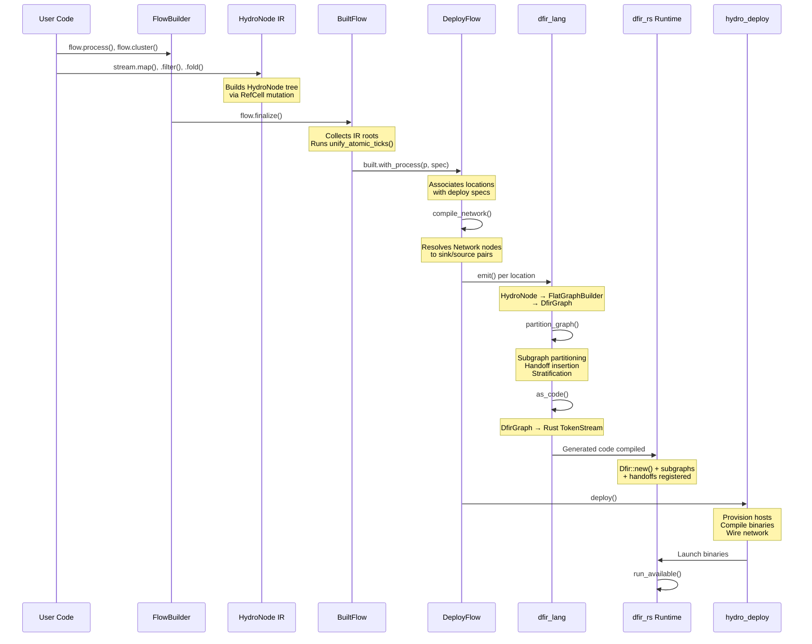

### DFIR Graph Compilation Detail

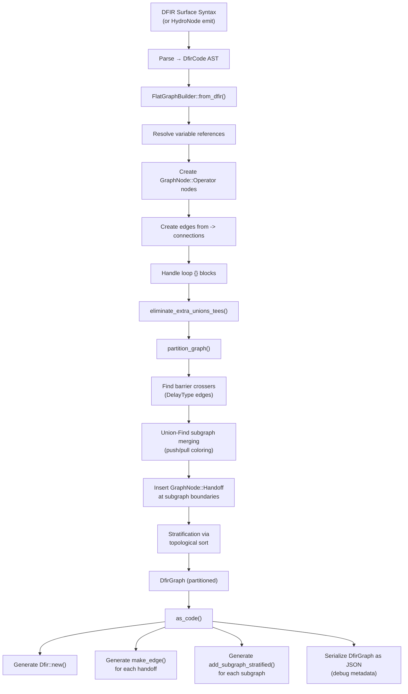

---

## Runtime Execution

### Tick Execution Model

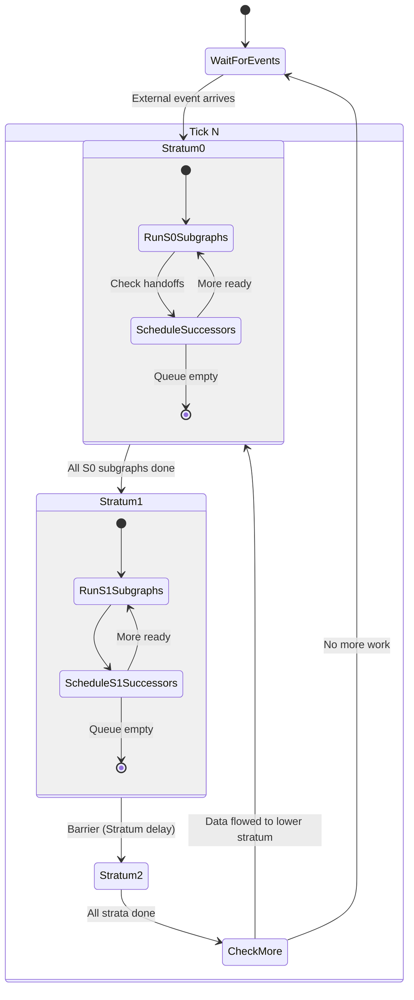

### Subgraph Execution

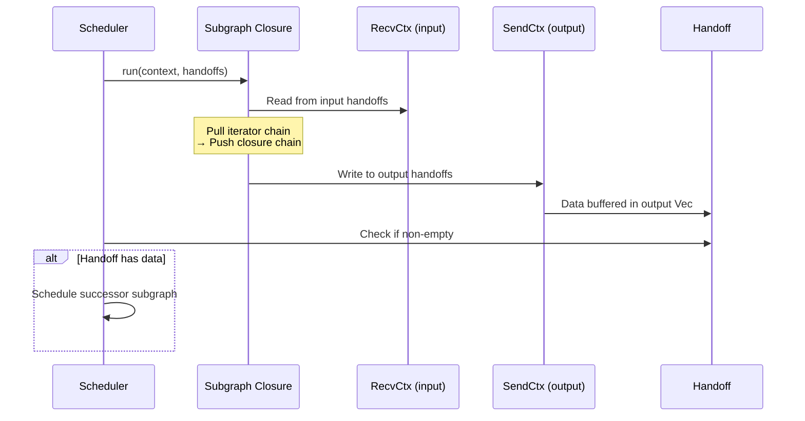

### Loop Execution

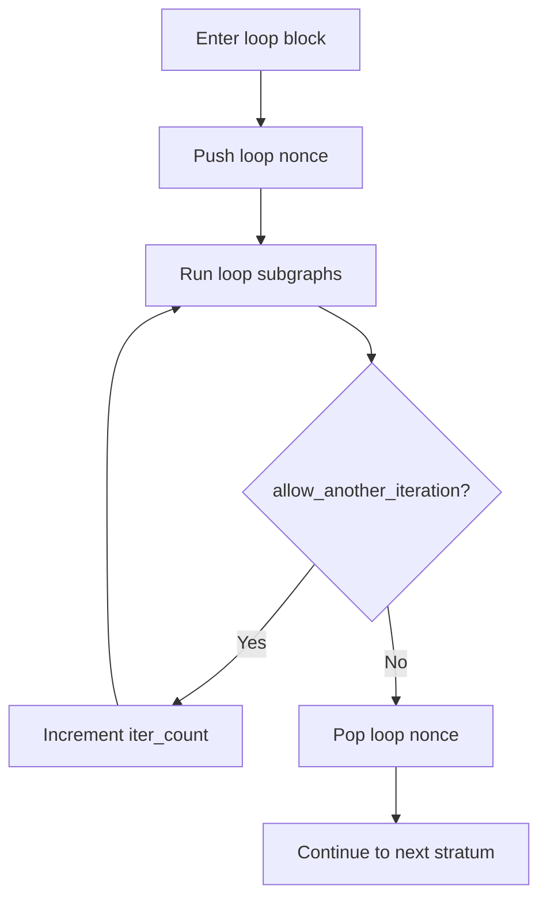

---

## Development Workflows

### Local Development Cycle

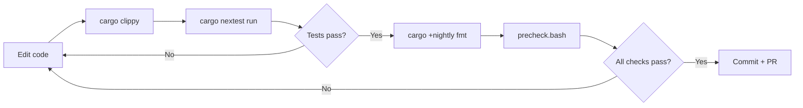

### precheck.bash Workflow

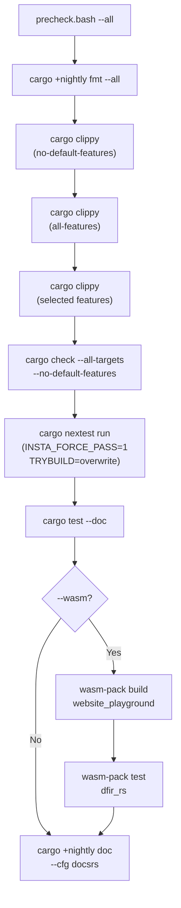

### CI Pipeline

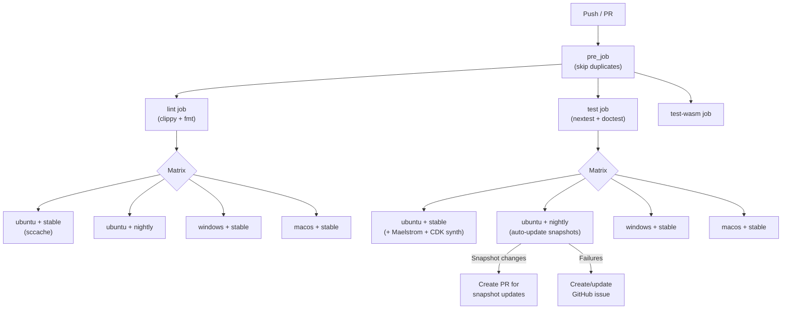

### Release Workflow

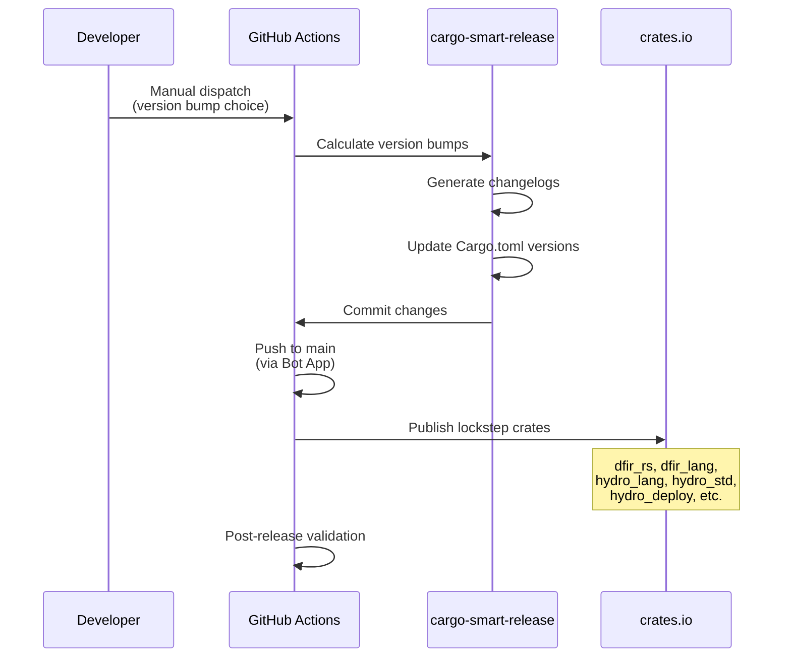

---

## Deployment Workflow

### Deploy Lifecycle

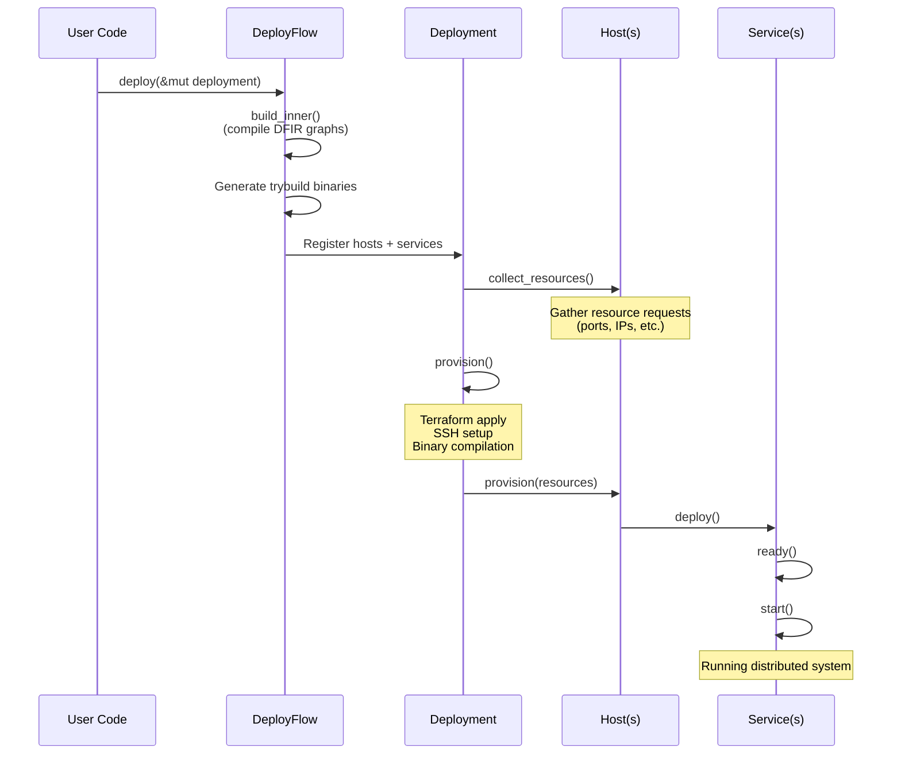

### Network Wiring

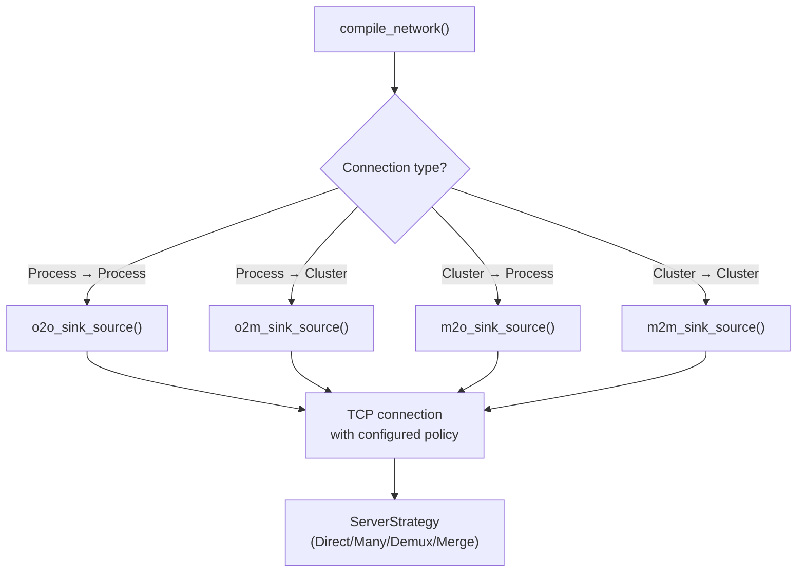

---

## Testing Workflows

### Snapshot Testing

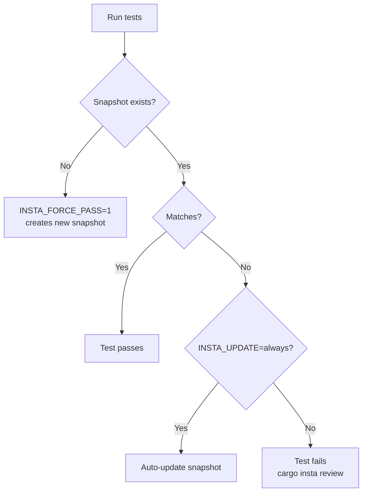

### Simulator Testing

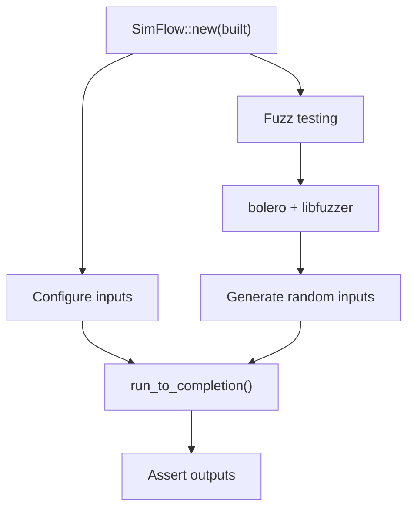

### Trybuild Compile-Fail Tests

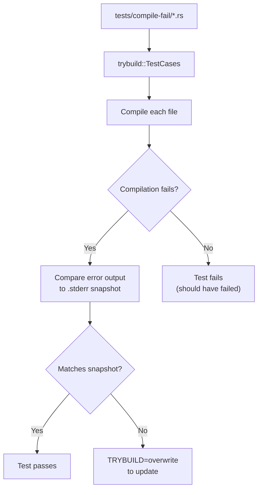
